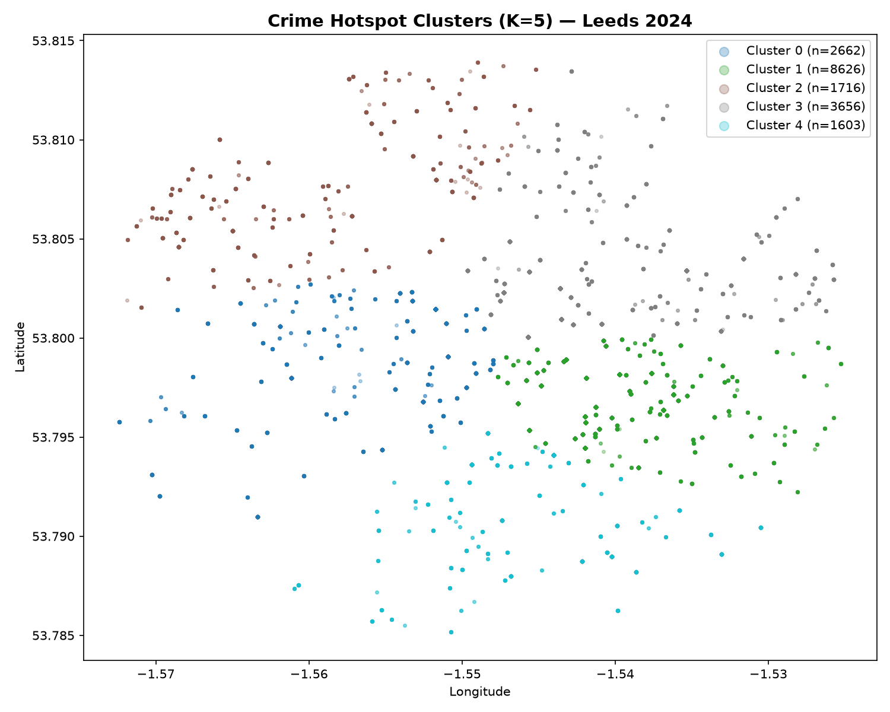

# 🔍 UK Crime Explorer — Leeds 2024

An end-to-end data science project exploring street-level crime patterns across Leeds using real UK Police data.

**[🚀 Live Demo](YOUR_STREAMLIT_URL_HERE)** · **[📊 Data Source](https://data.police.uk)**



---

## 📌 Project Overview

This project demonstrates a full data science pipeline:
- **Data ingestion** from the UK Police public API (no authentication required)
- **Exploratory data analysis** across 18,263 crime records from 2024
- **Unsupervised ML** using K-Means clustering to identify geographic crime hotspots
- **Interactive dashboard** built with Streamlit — filterable by category, month, and cluster

---

## 🔑 Key Findings

- **Violent crime** is the most common category across all clusters in Leeds 2024
- **5 distinct geographic hotspots** identified via K-Means clustering
- Crime volume peaks in **August** and is lowest in **February**
- Cluster 4 (south Leeds) shows a higher concentration of **shoplifting** vs other clusters

---

## 🛠 Tech Stack

| Layer | Tools |
|---|---|
| Language | Python 3.14 |
| Data ingestion | `requests`, `pandas` |
| Analysis | `pandas`, `matplotlib`, `seaborn` |
| Machine learning | `scikit-learn` (KMeans, StandardScaler, silhouette score) |
| Dashboard | `Streamlit`, `folium`, `streamlit-folium` |
| Dependency management | `Poetry` |
| Deployment | Streamlit Cloud |

---

## 📁 Project Structure

---

## 🚀 Run Locally

**Prerequisites:** Python 3.10+, Poetry

```bash
# Clone the repo
git clone https://github.com/YOUR_USERNAME/uk-crime-explorer.git
cd uk-crime-explorer

# Install dependencies
poetry install

# Fetch the data
poetry run python src/ingest.py

# Run clustering
poetry run python src/clustering.py

# Launch dashboard
poetry run streamlit run src/dashboard.py
```

---

## 📈 ML Approach

**Algorithm:** K-Means clustering on latitude/longitude coordinates
**Preprocessing:** StandardScaler to normalise geographic coordinates
**K selection:** Evaluated K=2–10 using both the elbow method (inertia) and silhouette score
**Result:** K=5 chosen for geographic interpretability (silhouette scores were similar across K=2–10, indicating evenly distributed crime across Leeds city centre)

---

## 👤 Author

**ThinYadanar Oo**
MSc Data Science — University of Sunderland
[LinkedIn](https://www.linkedin.com/in/thin-yadanar-oo-b72936241/) 
[GitHub](https://github.com/odette-eleanor/uk-crime-explorer)

